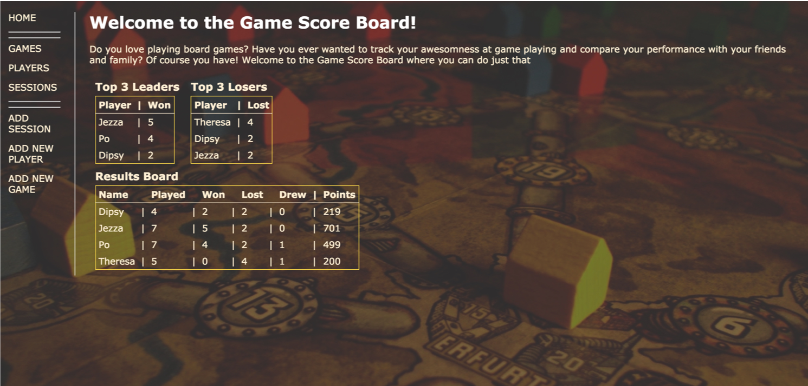

# Game Score Board

Built as my first project during [CodeClan's](https://codeclan.com/) Professional Software Development Course.




## What it does
Using [Ruby](https://www.ruby-lang.org/en/) and [SQL(Postgres)](https://www.postgresql.org/), this CRUD [Sinatra](http://www.sinatrarb.com) application allows you to add games, players, and record the results of sessions played by those players with those games. You can also store images against the players and the games. The opening page of the app has a leaderboard populated with results from the relational database. The app has been styled using HTML and CSS.

## How to use it

### Install Ruby
You can install and use a package manager like [Homebrew](https://brew.sh/) for this

```
brew install ruby
```

The application was built with Ruby 2.4.1.

You can install a Ruby manager such as [rbenv](https://github.com/rbenv/rbenv#readme) to manage multiple installations of ruby. You can temporarily set a shell-specific Ruby version to run this application

```
rbenv shell 2.4.1
```

### Install PostreSQL
```
brew install postgresql
```

### Run the game_score_board web application on  localhost
1. Open up a terminal window, navigate to the project folder, and type the following in the command line interface:
```
ruby app.rb
```

2. Open a browser window with the URL: 

http://localhost:4567/


### Database seeding
An initial set of dummy data (db/seeds.rb) is provided to the database when installed.

If you make any changes to the db/seeds.rb file, you need to run it after to implement those changes:

```
ruby db/seeds.rb
```

Warning: running the db/seeds.rb file will delete all existing data before repopulating with the seed data provided in the file.
